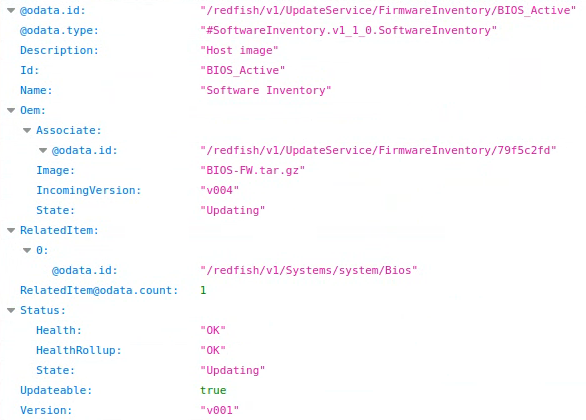
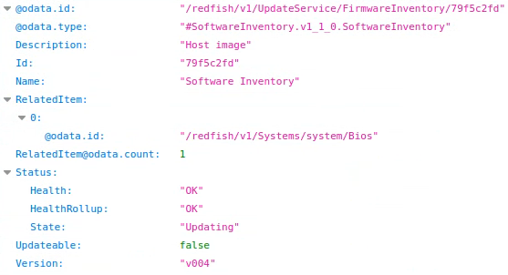

# Component Firmware Update and Management

The ***phosphor-software-manager*** and the ***updater-serivce of the bmcweb*** provides a very good solution for firmware inventory management.

### **BUT** 
- It is hard for users to recognize a firmware inventory
- It is hard for users to know what's going on during the firmware update and what the progress is.
- It cannot provide a dynamic method for platforms to create component inventories.
- It cannot cover all components, such as CPLD,
  or you need to create another recipe for it, e.g., the phosphor-psu-code-mgmt.
- It is hard to specify a component to update in that situation, if there are multi-same-components,
  e.g., CPLDs on extended boards.
- It is hard for platforms to use the same update-tool.

    For example, the BIOS firmware update,
    the preparation of update may be different with each platform design,
    and so as the actions after update.

If you make an overview of the component firmware update, you will find most update steps are similar, so, they can be abstracted,
we can extract the common part and provide a framework/method for platforms to increase code reuse.

Hence I make 2 services the component-manager and the updater-proxy,
and make a design pattern for component update tools to implement the communication between the updater-proxy and the update-tool (currently I've done BIOS and CPLD update tools).

And modify the ***phosphor-software-manager*** and the ***updater-serivce of the bmcweb*** to solve the problems above and provide an solution for platform porting and maintenance.

With this solution, whenever there is a new component firmware update feature request, we can just focus on the new component update tool development, and make a little modification of the others.

Below is a brief figure to illustrate the flow of component firmware update

Below link demos the BIOS firmare update with debug mode

- **https://www.linkedin.com/posts/** //TODO

## **The component-manager**
This service is to
- Provide generic DBus methods for actions of before-update and after-update
- Provide generic DBus methods/properties for component information
- Provide managebility of components
- Provide frameworks/platform hook functions to simplify platform porting

    For example

    

And the ***phosphor-software-manager*** will according to the DBus interfaces automatically create its interfaces

## **The updater-proxy**

As its name - proxy, it is responsible for launching the component update tool accordingly and monitoring the progress, and reporting it to the phosphor-image-updater.

When the update failure occurs, users can know the fail reason, which will be very helpful for troubleshooting.

## **The modification of the Redfish Update Service**

- Support MultipartHttpPushUri
- Support StartUpdate Action
- Add an OEM property to display more information

Thank and appreciate the OpenBMC community for sharing the MultipartHttpPushUri solution!

***https://gerrit.openbmc.org/c/openbmc/bmcweb/+/32174***

That inspires me and I can base on it to implement the Component Firmware Update solution. 

The below demos update the BIOS firmware with Applytime - OnStartUpdateRequest.

We can know which target is to be updated and what's the image, the incoming version, etc.

After sending the URI -
    /redfish/v1/UpdateService/Actions/UpdateService.StartUpdate

## **Aditional Improvement**

- Auto override duplicate candidate component firmware

    Scenario:

        Case 1:
        If a user sends the Redfish URI - redfish/v1/UpdateService/upload
        with Applytime - OnStartUpdateRequest for updating BIOS.
        But before sending the URI - redfish/v1/UpdateService/Actions/UpdateService.StartUpdate,
        the user sends the URI - redfish/v1/UpdateService/upload again,
        the previous one will be replaced with the new one.

        Case 2:
        If an update failure occurs, once a user launches a new update again the previous one will be deleted.

        This improvement can save memory and prevent potential memory leaks risk, and make the firmware inventory clean.

Example:

Upload the BIOS FW v004 tarball first 

upload again with BIOS FW v005 tarball

