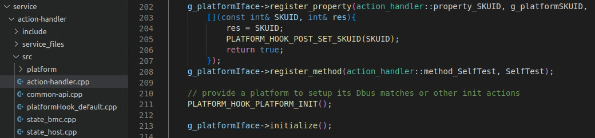

# meta-alan

## Introdution

**OpenBMC** is a super powerful ecosystem for server BMC development and the **Yocto** , a powerful building system, provides a lot of flexible methods to develop so that we can easily modulize our work.

In order to fulfill large, rapid customized demands, we must modify or remake the existing solution.
Less and meaningful modification, and making every feature/function reusable is a very important thing.

Based on my knowledge and experience, I build up this **Porting System** to separate the **Common Code*** code and the ***Platform Code***.
The **Common Code*** handles a lot of the details and provides frameworks/functions for platforms,
the ***Platform Code*** ports its needs without knowing everything.

In doing so, it has these goals:
- **Increase code-reuse**
- **Increase overall code-maintainability**
- **Speed development time for new systems or new SKUs**
- **Provide the *Newers* a development environment to quickly start**

### The Term Definition:

- ***Common Code*** means the common part of the server vendor (e.g., Hyve) code modification/development.
- ***Platform Code*** means platform-dependent code modification/development of the server vendor.

### The brief layout of this layer
    meta-alan
        ├── meta-common
        │
        ├── meta-alanw2600
        │       │
        │       ├── meta-alanw2600-generic
        │       │                        ├── SKU0
        │       │                        ├── SKU1
        │       │                        │...
        │       │
        │       ├── meta-alanw2600-custom1
        │       │                        ├── SKU0
        │       │                        ├── SKU1
        │       │                        │...
        │       │
        │       ├── meta-alanw2600-custom2
        │       ├── meta-alanw2600...
        │
        ├── meta-other-platform
        │...

- The **meta-common** layer is the core of the **meta-alan**, the basic infrastructure, each project(platform) is built on this layer.
It provides most common functions, features, and platform hook functions/configurations.
It hides the details of implementation, each project just needs to according to the "RULE" to setup and port their implementation.

- The **meta-xxx** platform layer and its sub-meta-layer represents a machine, most of the content of this layer are bbapend files to provide configurations or the implementation of the platform-related functions.
Each machine is designed to support one-image for multi-SKUs.

## Key Features:

- **Platform Global Configuration**

    Some recipes are designed or modified to accept specific config variable to enable/disable/setup functions. A platform can easily configure its setting via the **platform_configs.inc** file.

    ***For example, the BMC EEPROM access information***
    
        EEPROM_MAC_I2C_BUS = "7"
        EEPROM_MAC_I2C_ADDRESS = "0x50"
        EEPROM_MAC2_OFFSET = "0x0A08"
        EEPROM_MAC3_OFFSET = "0x0A10"
        EEPROM_DEV_GUID_OFFSET = "0x0A28"
        EEPROM_SYS_GUID_OFFSET = "0x0A38"

    These settings can be automatically applied to the platformconfig and the u-boot-aspeed-sdk.

    Below is the platformConfig header file generated by the platformconfig recipe,
    which can be used for other recipes.
    
    

    Below is the platformConfig header file generated by the u-boot-aspeed-sdk recipe.

    

- **Platform Hook Function / Override Function**

    Some recipes are designed or modified to provide hook functions or override functions to increase code reuse and reduce the effort of porting.

    ***For example, the hook functions for the u-boot-aspeed-sdk recipe***
    A platform can implement the hook function straightly without patching.

    

    

    ***For example, the override functions for the platform action-handler recipe***

    A platform can implement its override functions or specific implementation  just like implementing a library but without much work to do that.

    Below is the part of the action-handler, the *PLATFORM_HOOK_POST_SET_SKUID* and the *PLATFORM_HOOK_PLATFORM_INIT* are functions for a platform to override.

    

    Below demos how a platform can implement its override functions by the bbppend recipe.

    

    

- **A Powerful Library - libsdrcache**

    **1. Provide an easy way to configure the SDR**

    Very appreciate OpenBMC community provides the powerful method for dynamically sensor implementation (the entity-manager and the dbus-sensors). But most of the time we need every sensor has a fixed sensor number and the SDR information. That is a pain for the BMC enginners to maintain or port the SDR.

    The **sdr-database** provides the most common-use SDR definitions,

    

    A platform can choose/add thier needs by bbppend.

    

    The SDR Database Configuration is Brief.

    SDR-Type1

    

    SDR-Type2

    

    SDR-Type3

    

    **2. Incredibe Performance**

    As its name, it provides a cache to speed up the use scenario.

    For example the *ipmitool sdr elist all* command

    Below shows the result of enhancement, you can see the total time cost is **just 0.923 seconds** and the SDR count is more than below ***before-improving***

    

    before-improving

    

    Below is a video demo

    - **https://www.linkedin.com/posts/activity-6986953818756329472-oLcp?utm_source=share&utm_medium=member_desktop**

    **3. Extend The Possibility of Feature Implementation**

    This library is not just for the **phosphor-ipmi-host** but also for the **phosphor-sel-logger**.

    Since able to provide SDR information, the  phosphor-sel-logger can parse the IPMI SEL, that can be used for event filter, event-handle action, IPMI SEL tranlated to Redfish event format, etc.

- **Multi-SKU Support Design Aimed**

    **1. Provide platforms a flexible method to choose the Kernel DTB in run-time**

    There is a u-boot env varible - **fdt_config** and also a platform hook function - **board_preset_env**, a platform can use them to select which kernel DTB to boot to implement **One-Image for Multi-SKUs**.

    A platform can build in multi kernel DTBs by

    

    Below link demos boot with different kernel DTB

    - **https://www.linkedin.com/posts/activity-6986955754855440384-KIoi?utm_source=share&utm_medium=member_desktop**

    **1. Provide platforms a flexible method to choose the Fan PID Config**

    The action-handler provides a platform hook function ***PLATFORM_HOOK_GET_FAN_TABLE_NAME*** to choose the Fan PID Config accordinglly or even can ovrride the post_set_SKUID by ***PLATFORM_HOOK_POST_SET_SKUID***.

    

- **Component Management and Firmware Updare**
    
    (For more details, please see **https://github.com/alan3138319/AlanW/blob/master/ComponentMgmtFWupdate.md**)

    **- Provide more detail information of firmware inventory**

    

    

    **- Provide information of update progress/state/fail reason**

    

    **- Provide frameworks/platform hook functions to simplify platform porting**

    Below link demos the BIOS firmare update with debug mode

    - **https://www.linkedin.com/feed/update/urn:li:activity:7030112532245737472/**

- **Common Libraries/Tools For Platform Using**

    The **recipes-alan** provides libraries/tools for platform porting needs to increase code reuse.

    

### If you have an interest, it's very welcome to contact me.
- **https://www.linkedin.com/in/alan-wang-8b48b9248/**
* **alan3138319@gmail.com**
