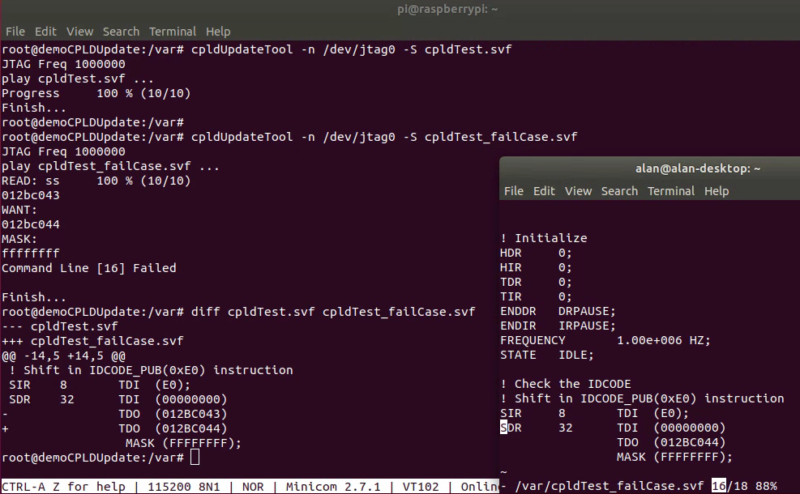
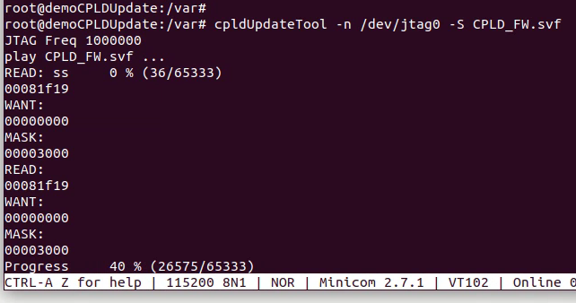
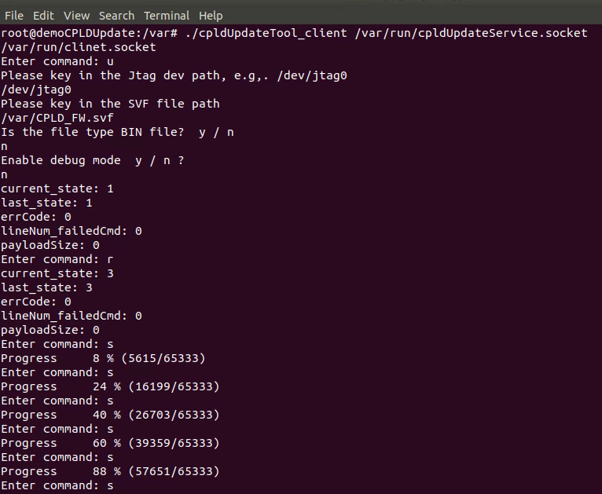

## Serial Vector Format SVF) is very helpful for debugging CPLD update!

- Human readable format
- Most CPLD vendors (Lattice, Altera, Xilinx, etc) support it

I refer to ***https://github.com/AspeedTech-BMC/aspeed_app/tree/master/svf*** to make a cpldupdateTool.

It can indicate which command line failed,
as the above fig shows the fail line number is 16,
so we can know the fail is an incorrect ID Code match.

It can not only just for CPLD update but also for "playing" a command script.

It can be excuted as a command line tool

Or be excuted as a background service which is for the BMC to implemt remote CPLD update.

